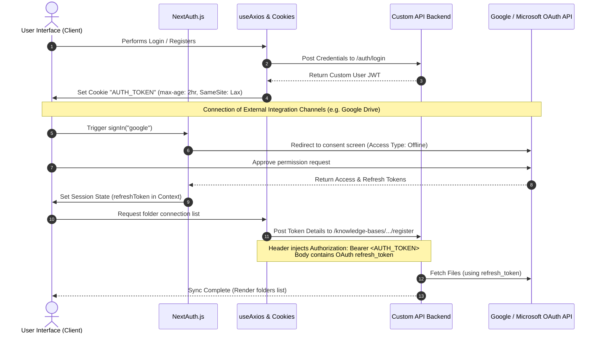

# Project Architecture, Security & Structure Documentation

This document provides a detailed overview of the **Gsearch** application architecture, security implementations, package dependencies, and folder structure.

---

## 1. Authentication & Security Architecture

The project implements a **dual-authentication architecture** to separate core application access from third-party enterprise data source integrations.

### A. Custom Authentication (Core User Access)
For standard user registration, login, password recovery, and secure sessions, the application uses a custom-built JWT (JSON Web Token) cookie-based authentication flow.

*   **Login & Registration Flow:**
    *   The frontend Form (`LoginForm` in [LoginForm.tsx](file:/app/features/auth/components/LoginForm.tsx)) triggers the custom hook `useLogin` ([useLogin.ts](file:/app/features/auth/hooks/useLogin.ts)).
    *   It submits the credentials to the backend endpoint `/auth/login` (defined in [endpoints.ts](file:/app/services/endpoints.ts)).
*   **Token Storage & Cookie Security:**
    *   Upon successful verification, the API backend returns a JWT access token.
    *   The frontend saves this token as a client cookie using `setCookie("AUTH_TOKEN", token)` ([cookies.ts](file:/app/config/cookies.ts)).
    *   The cookie is configured with a `max-age` of 7200 seconds (2 hours) and `samesite=lax` to protect the application from **Cross-Site Request Forgery (CSRF)** attacks.
*   **Authorized HTTP Requests:**
    *   The customized Axios hook `useAxios` ([useAxios.ts](file:/app/hooks/useAxios.ts)) acts as the API client.
    *   For every outgoing request, it retrieves the `AUTH_TOKEN` from cookies using `getCookie("AUTH_TOKEN")` and appends it to the header as a Bearer Token:
        ```javascript
        Authorization: Bearer <AUTH_TOKEN>
        ```
*   **Session Guard / Route Protection:**
    *   In the event that an API request fails with a `401 Unauthorized` status (indicating an expired or invalid token), the `useAxios` hook automatically catches this error, triggers a toast alert, and redirects the client to the `/login` page (`router.push("/login")`).

---

### B. OAuth Integration Authentication (NextAuth.js)
To support connecting enterprise external data sources (Google Drive, Gmail, SharePoint, Outlook), the project integrates **NextAuth.js** (`next-auth`) to orchestrate OAuth 2.0 protocol flows.

*   **OAuth Providers Configuration:**
    *   Configured in [authOptions.ts](file:/app/api/auth/authOptions.ts), supporting two enterprise providers:
        1.  **Google Provider:**
            *   *Scopes requested:* `openid`, `email`, `profile` (for auth), plus `drive.readonly` (for Google Drive document syncing), `gmail.readonly`, and `gmail.labels` (for importing email threads).
            *   *Access Type:* Configured with `access_type: "offline"` and `prompt: "consent"` to guarantee Google issues a `refresh_token`, allowing the system to sync data in the background.
        2.  **Azure Active Directory (Microsoft Entra ID) Provider:**
            *   *Scopes requested:* `openid`, `profile`, `email`, `offline_access` (for offline background tokens), `User.Read` (basic user details), `Files.Read.All` (for SharePoint/OneDrive document syncing), and `Mail.Read` (for Outlook emails).
            *   *Tenant:* Set to `"common"` to enable multi-tenant corporate sign-ins.
*   **Token Bridging Flow:**
    1.  When a user links their Google or SharePoint channel in the dashboard integrations panel ([ChannelsSection.tsx](file:/app/dashboard/integrations/ChannelsSection.tsx)), the application invokes NextAuth's `signIn("google")` or `signIn("azure-ad")`.
    2.  NextAuth manages the OAuth redirect and authentication. The response tokens are intercepted in callbacks (`jwt()` and `session()`), saving the OAuth access tokens and refresh tokens into the active React Session context (`SessionProvider` in [GlobalProvider.tsx](file:/app/components/provider/GlobalProvider.tsx)).
    3.  The frontend reads the integration token (e.g., `session?.refreshToken` or `session?.sharepointAccessToken`).
    4.  It then calls the platform's backend registration API (e.g., `/knowledge-bases/{kbId}/google-drive/register`) using the core `AUTH_TOKEN` (via `Authorization: Bearer` header) and sends the integration's OAuth refresh token in the body.
    5.  This allows the backend server to securely connect to Google or Microsoft APIs in the background without exposing client credentials.

---

## 2. Folder Structure & Codebase Maintenance

The codebase follows the **Next.js App Router (v16.2)** folder structure combined with a **Feature-based layout** inside the `/app` folder. This ensures separation of concerns, high modularity, and easy scaling.

```text
c:/Users/Gokul/Desktop/PythonProject/GRAG/Grag
├── app/                          # Main Application Directory (App Router)
│   ├── (auth)/                   # Route Group for auth pages (unaffected URL paths)
│   │   ├── forgot-password/      # Page for password recovery request
│   │   ├── login/                # Page for standard username/password login
│   │   ├── register/             # Page for new user account registration
│   │   └── reset-password/       # Page for submitting new password
│   ├── api/                      # Next.js Serverless Route Handlers
│   │   ├── auth/
│   │   │   ├── [...nextauth]/    # Catch-all endpoint handler for NextAuth.js
│   │   │   └── authOptions.ts    # Config for Google & Azure AD OAuth providers
│   │   ├── drive/                # Endpoint routines for Google Drive actions
│   │   └── sharpoint/            # Endpoint routines for SharePoint/MS Graph actions
│   ├── components/               # Global / Shared Reusable UI Components
│   │   ├── landing/              # Landing page marketing components
│   │   ├── layout/               # Shell layouts, headers, sidebars
│   │   ├── lib/                  # UI library assets
│   │   ├── provider/             # Session, Query, Theme, & UI Config Providers
│   │   └── ui/                   # Primitive styles & design elements
│   ├── config/                   # Global configuration parameters
│   │   ├── config.ts             # Environment configuration variables
│   │   ├── cookies.ts            # Client-side cookie utilities (set, get, delete)
│   │   └── loader.ts             # Global loading bar animations triggers
│   ├── dashboard/                # Main application workspace view dashboard routes
│   ├── features/                 # Domain/Feature-Specific Modular folders
│   │   ├── auth/                 # All Auth components (LoginForm.tsx), APIs, types, schemas
│   │   └── users/                # User profile management files
│   ├── hooks/                    # Global React Hooks
│   │   ├── useAgents.ts          # State/fetching hook for AI agents
│   │   ├── useAxios.ts           # Central HTTP Client wrapper (cookies token injection)
│   │   └── useStore.ts           # Zustand global state manager hook
│   ├── lib/                      # Core utility scripts (e.g. schemas, helper engines)
│   ├── services/                 # API route mapping and configurations
│   │   ├── axios.ts              # Axios custom configuration
│   │   ├── endpoints.ts          # Dictionary mapping API endpoints & HTTP verbs
│   │   └── routes.ts             # Frontend URL path mappings
│   ├── globals.css               # Global CSS styling
│   ├── layout.tsx                # Base HTML Shell, Fonts, Metadata and Providers layout
│   └── page.tsx                  # Home landing route
├── public/                       # Static public assets (images, logos, widget js)
│   ├── chat.js                   # External embeddable chat script
│   └── 512_512.png               # Web application icon asset
├── next.config.ts                # Next.js compilation settings
├── tsconfig.json                 # TypeScript compiler parameters
├── package.json                  # Dependencies manifest
└── .env                          # Local Environment variables configurations
```

---

## 3. Libraries & Dependencies

Below is a detailed breakdown of all the packages listed in `package.json` and their explicit roles in the Gsearch project:

### Core Frameworks
| Library | Version | Purpose in Project |
| :--- | :--- | :--- |
| **`next`** | `16.2.4` | The primary React framework. Handles Server-Side Rendering (SSR), API route endpoints, client-side routing, and overall optimization. |
| **`react`** / **`react-dom`** | `19.2.4` | UI rendering engine. |
| **`typescript`** | `^5` | Ensures static type safety and increases developer efficiency during modifications. |

### Authentication & API Services
| Library | Version | Purpose in Project |
| :--- | :--- | :--- |
| **`next-auth`** | `^4.24.14` | Orchestrates Google OAuth & Azure AD integration flows securely. |
| **`axios`** | `^1.15.1` | Used inside the `useAxios` wrapper to construct HTTP calls to backend servers. |
| **`js-cookie`** | `^3.0.7` | Provides light utility wrappers to read/write auth tokens into the client browser cookies. |
| **`@tanstack/react-query`** | `^5.99.2` | Manages state fetching, client caching, and background synchronizations for api requests. |

### User Interface & Layout Styles
| Library | Version | Purpose in Project |
| :--- | :--- | :--- |
| **`antd`** | `^6.3.6` | The primary visual UI components framework. Provides clean tables, layouts, modals, and loader structures. |
| **`@ant-design/icons`** | `^6.1.1` | Renders vector icons natively built for Ant Design. |
| **`@ant-design/nextjs-registry`** | `^1.3.0` | Prevents style flickering issues during Next.js SSR build renders. |
| **`framer-motion`** | `^12.42.2` | Renders high-fidelity interactive transition animations. |
| **`lucide-react`** / **`react-icons`**| `^1.8.0` / `^5.6.0` | Expansive library for lightweight and scalable UI icons (e.g., eye toggle, settings). |
| **`bootstrap`** | `^5.3.8` | Provides backup utility styling layouts. |
| **`tailwindcss`** / **`@tailwindcss/postcss`** | `^4` | Main utility styling classes layer for fast, custom CSS styling. |

### Forms & Validation
| Library | Version | Purpose in Project |
| :--- | :--- | :--- |
| **`react-hook-form`** | `^7.72.1` | Standardizes user input capture, handling form state, submissions, and inputs efficiently. |
| **`@hookform/resolvers`** | `^5.2.2` | Integrates third-party validators like Zod with React Hook Form. |
| **`zod`** | `^4.3.6` | Declarative validation schema defining criteria for registration/login data types. |

### Data Processing & Utilities
| Library | Version | Purpose in Project |
| :--- | :--- | :--- |
| **`zustand`** | `^5.0.12` | Manages global React states, such as the `userId` hook. |
| **`recharts`** | `^3.8.1` | Draws SVG charts for token metrics and user analytics dashboards. |
| **`react-force-graph`** / **`2d`** | `^1.48.2` | Generates interactive, force-directed network graph displays to represent RAG vector databases. |
| **`marked`** | `^18.0.5` | Converts Markdown generated by AI backend models into clean, styled HTML text tags. |
| **`xlsx`** | `^0.18.5` | Parser/writer engine enabling import/export operations on Excel spreadsheet documents. |
| **`googleapis`** | `^173.0.0` | SDK to query Google Drive directories and download contents. |
| **`@microsoft/microsoft-graph-client`** | `^3.0.7` | Client SDK to query SharePoint lists, Outlook files, and drive contents. |
| **`react-hot-toast`** / **`sonner`**| `^2.6.0` / `^2.0.7` | Provides toast notification popups for success/error API messages. |

---

## 4. Key Connections Diagram (Security & Integration)

The flowchart below showcases how the custom authentication cookie (`AUTH_TOKEN`) interacts alongside NextAuth OAuth configurations during external resource synchronization:


