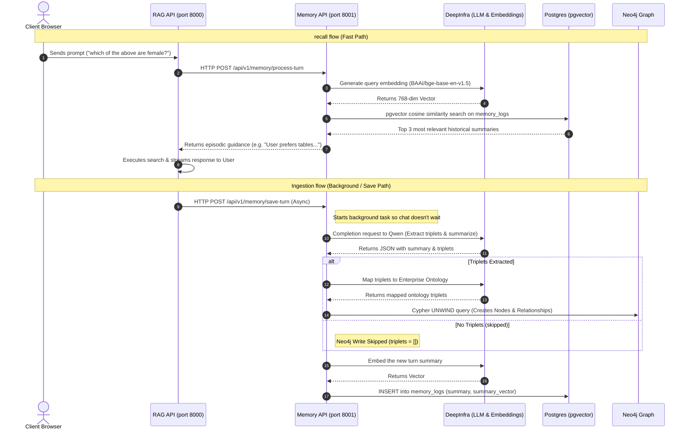

# Long-Term Memory API Architecture & Workflow Guide

This document explains the architecture, tech stack, dependencies, database schema, and operational workflow of the **Long-Term Memory API** (`memory-api`) microservice.

---

## 1. Overview
The `memory-api` is a dedicated, self-contained microservice built to manage **Long-Term Episodic and Preference Memory** for RAG agents. It ensures that user preferences, facts, and past conversation contexts are remembered across different chat sessions.

It handles:
1. **Fact & Triplet Extraction:** Dynamically parsing chat transcripts to pull out concrete user preferences and saving them.
2. **Episodic Recall:** Performing vector similarity searches over past session summaries to fetch contextually relevant memory.
3. **Graph Storage (Neo4j):** Mapping open-domain triplets into an isolated graph structure for multi-agent relation mapping.

---

## 2. Tech Stack & Core Tools

The service is built on the following technologies:

| Component | Tool / Library | Purpose |
| :--- | :--- | :--- |
| **Web Framework** | FastAPI (Python) | High-performance API endpoints and asyncio lifecycle management. |
| **Relational Database** | PostgreSQL | Stores structured memory summaries, settings, and tables. |
| **Vector Search** | pgvector (PostgreSQL) | Performs cosine distance vector similarity search on historical memory embeddings. |
| **Graph Database** | Neo4j | Stores extracted entities and relationships (triplets) for knowledge graph queries. |
| **Database ORM** | SQLAlchemy (Async) | Non-blocking database transactions and operations. |
| **HTTP Client** | HTTPX | Handles asynchronous requests to DeepInfra / Ollama for embeddings and chat completions. |
| **Environment Config** | Pydantic / dotenv | Loads config variables (`LLM_BASE_URL`, `POSTGRES_URL`, `NEO4J_URI`, etc.) securely. |

---

## 3. Database Models & Schema

The service relies on two main tables:

### 1. `memory_settings`
Manages configuration flags for how memory behaves per tenant/agent.
* `tenant_id` (UUID, Primary Key)
* `agent_id` (UUID, Primary Key)
* `episodic_enabled` (Boolean) - Turns long-term summary memory on/off.
* `semantic_enabled` (Boolean) - Turns triplet memory on/off.
* `memory_ttl_days` (Integer) - Lifespan of memory logs.

### 2. `memory_logs`
Stores the actual vectorized episodic summaries.
* `id` (UUID, Primary Key)
* `tenant_id` (UUID, Index)
* `user_id` (UUID, Index)
* `agent_id` (UUID, Index)
* `session_id` (UUID)
* `summary` (Text) - The condensed text summary of the turn.
* `summary_vector` (Vector(768 / 1536)) - Embeddings of the summary for pgvector search.
* `created_at` (Timestamp)

---

## 4. End-to-End Workflow

The memory pipeline is split into two phases: **Ingestion** (Saving Memory) and **Recall** (Retrieving Memory).



### A. The Recall Workflow (Retrieval Path)
1. The user sends a new message to the **RAG API**.
2. Before querying the Knowledge Base, the **RAG API** makes an HTTP POST request to `/api/v1/memory/process-turn` on the **Memory API**.
3. **Memory API** sends the user's query to the embedding model (`BAAI/bge-base-en-v1.5`) via DeepInfra to generate a vector.
4. It performs a cosine distance similarity query using **pgvector** in PostgreSQL to search the `memory_logs` table for matching past turns.
5. It returns the top 3 relevant past memories as `episodic_guidance`.
6. The **RAG API** appends this guidance to the LLM system prompt so the LLM acts with historical context (e.g. *"Based on your saved profile, you prefer..."*).

### B. The Ingestion Workflow (Save Path)
1. Once the assistant finished streaming the response back to the user, the **RAG API** makes an asynchronous, non-blocking HTTP POST request to `/api/v1/memory/save-turn`.
2. The **Memory API** immediately returns `{"status": "queued"}` so the user experience has zero lag.
3. In the background, it runs an LLM completion query asking the model to do two tasks:
   * **Summarize the turn:** Create a short 1-2 sentence statement of what happened.
   * **Extract knowledge triplets:** Pull out structured facts (e.g., `["User", "LIKES", "Python"]`).
4. **Triplets mapping:**
   * If the user discussed personal facts, the triplets are sent to the ontology mapper and saved to **Neo4j** using an atomic Cypher transaction.
   * If the turn was generic (e.g., Q&A, greetings), the triplets list is empty `[]` and the Neo4j write is safely skipped to avoid cluttering.
5. **Summary embedding:** The text summary is embedded and stored in PostgreSQL (`memory_logs`) with its vector representation for future PGVector searches.

---

## 5. Directory Structure
```text
app/memory/
├── app/
│   ├── __init__.py
│   ├── config.py         # Config loader for DBs, LLM URLs
│   ├── database.py       # SQLAlchmy async session setup
│   ├── main.py           # Core FastAPI service, models, endpoints, LLM extraction
│   └── models.py         # SQLAlchemy definitions (memory_settings, memory_logs)
├── requirements.txt      # Microservice dependencies
├── server.py             # Uvicorn entry point (runs port 8001)
└── diagram.md            # Graphic overview of workflow
```
