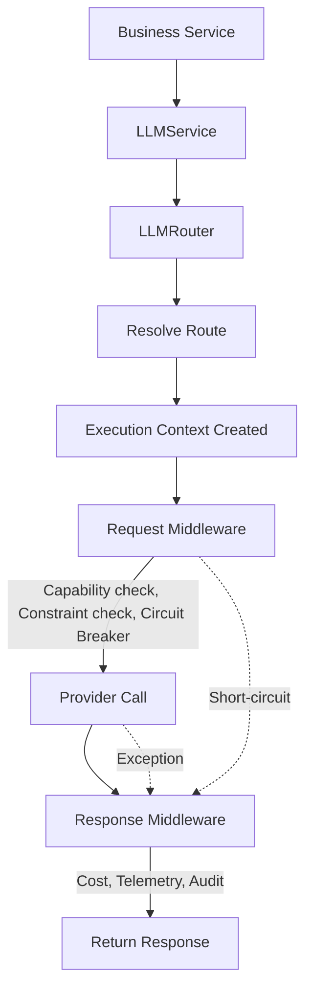
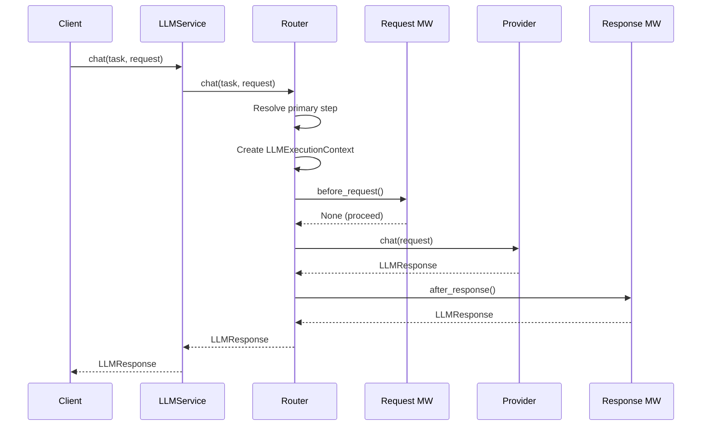
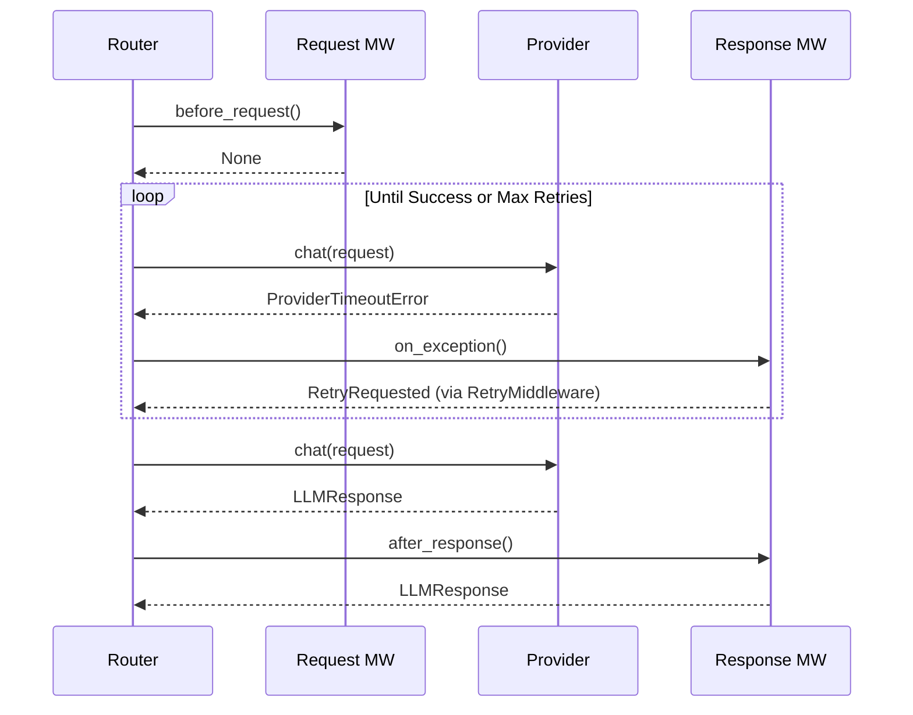
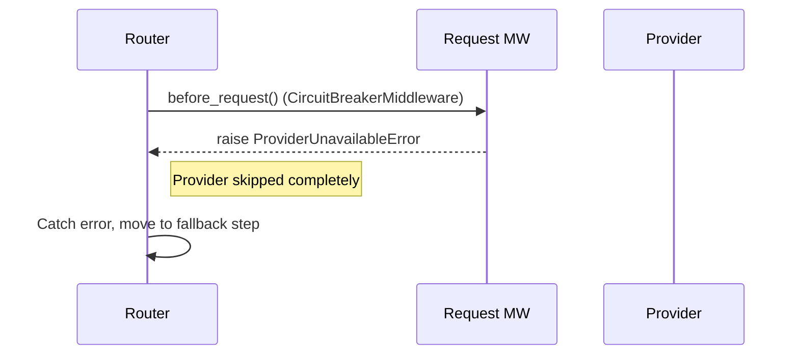
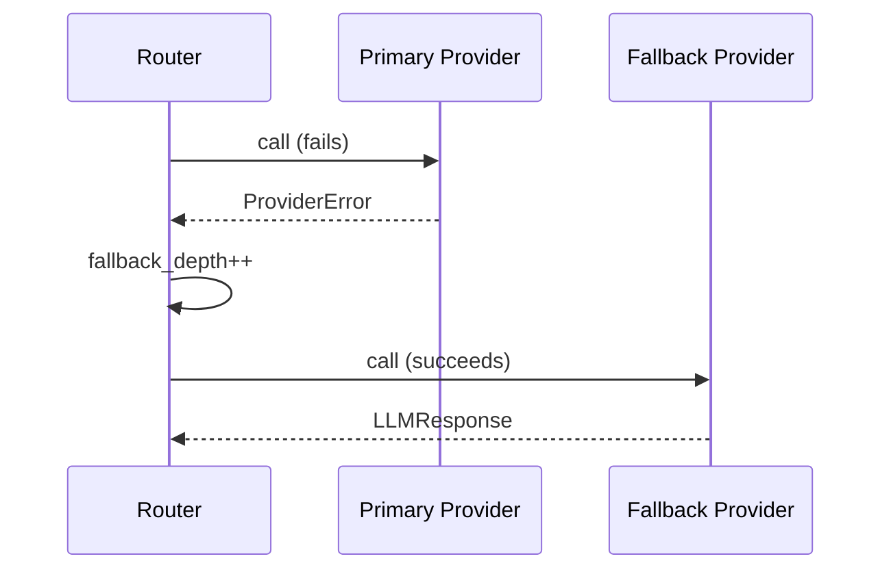

# 02 Request Lifecycle

This document visualizes the execution flow of a single LLM request through the orchestration platform. 

## The One Diagram That Matters Most

Every request flows through this uniform pipeline, regardless of the underlying task or chosen provider.

## Sequence Diagrams for Operational Behavior

### 1. Normal Request

### 2. Retry Flow

### 3. Circuit Breaker Trigger

### 4. Fallback Flow

