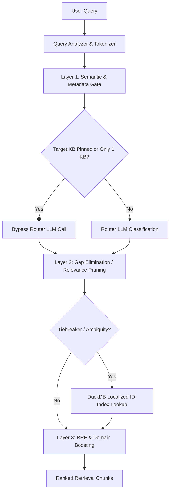

# RAG System Upgrades: File-Filtering, CSV Engine, Prompt Security & Weekly Task Documentation

## 1. Smart File-Filtering & Intelligent Routing Process

To resolve document routing ambiguity (especially when multiple files share similar schema headers), we implemented a highly specialized **3-Layer Filtering and Routing System** coupled with localized ID indexes.

### Layer 1: Semantic Layer (Intent & Schema Overlap Scoring)
* **What it does:** Uses categorical values and schema layout terms to score candidate files.
* **Score Metrics (`schema_utils.py`):**
  * `cat_score`: Categorical match count.
  * `gen_score`: Column/schema name overlap.
  * *Calculation:* `total_score = cat_score * 2 + gen_score` (favoring categorical matches).
* **Router Bypass:** If a target `Knowledge Base (KB)` is pinned (`target_kb_id`) or only one candidate exists, the pipeline completely bypasses the router LLM call, saving latency (~2–3 seconds).

### Layer 2: Gap Elimination (Relevance Pruning)
* **What it does:** Filters out lower-quality files dynamically.
* **How it works:** Compares candidate relevance scores. If a KB's relevance score falls below a dynamically computed gap threshold (`GAP_THRESHOLD = 0.15`) relative to the top candidate, it is pruned.

### Layer 3: RRF & Exact Match Layer (Reciprocal Rank Fusion)
* **Reciprocal Rank Fusion (RRF):** Fuses scores from Graph Search, Keyword Search, Vector Search, and the newly added **Postgres Exact Match** search.
* **Postgres Exact Match:** We introduced an exact-match helper function (`_run_postgres_exact_match`) executing direct matching on exact IDs, which is combined into RRF scoring using a dedicated `WEIGHT_EXACT_MATCH` constant.
* **Domain Boosting:** If a document’s filename contains keywords extracted during the analysis phase, its chunks receive a dynamic boost.

### High-Cardinality ID Tiebreakers (DuckDB ID Indexes)
* **The Problem:** Column values with high cardinality (e.g. part numbers or employee IDs with >50 unique values) are excluded from standard categorical registries to keep metadata sizes small.
* **The Solution:** Added a `duckdb`-driven indexing step inside `ParquetIngester` to construct a local index (`_idindex.json`) during parquet ingestion. It converts unique ID values to trimmed uppercase strings.
* **Tiebreaker Resolution (`service.py`):** If multiple files produce tied categorical overlap scores, the system extracts the search term using a regex pattern (`ID_REGEX_PATTERN = r'(?=.*\d)[a-zA-Z0-9-]{5,}'`) and checks membership in the O(1) cached local ID index. The correct file matches receive a `+100` score boost to resolve routing.

---

## 2. CSV/Tabular Queries & Front-End Leak Mitigation

Previously, failed tabular analytical searches exposed raw database schema errors or raw LLM-generated SQL commands on the front-end user interface.

### Raw Query Exposure Guard
* **Before:** The system returned raw query planning tracebacks or bare SQL statements directly when queries yielded no records.
* **After (`pandas_engine.py`):**
  * Explicit user-safe message structure: `Error: {query_plan.explanation} \n No records matched your query. Not present in dataset.`
  * Standardized exception handling wraps analytical failures and prevents raw database error leaking. If SQL execution fails across all candidates in the cascade, the system drops the tabular routing flag and falls back to standard semantic RRF search.

### Database Schema Expansion (`add_db_columns.py`)
We verified/created the following schema structures to store RAG metadata:
1. **`pgvector` Verification:** Ensures `CREATE EXTENSION IF NOT EXISTS vector;` runs successfully.
2. **`knowledge_bases` Table Extensions:**
   * `summary_embedding` (vector(4096))
3. **Audit and Log Tables:**
   * **`llm_stage_usage_logs`**: Tracks token inputs/outputs, model, and costs.
   * **`app_error_logs`**: Tracks system errors, stack traces, and modules.

### Network Latency Reduction
* **WebSocket / Memory-API Optimization:** Shortened the connection timeout for the `memory-api` process turn loop from `8.0 seconds` to `2.0 seconds` (`websocket_core.py`), ensuring that slow historical lookups do not bottleneck live RAG responses.
