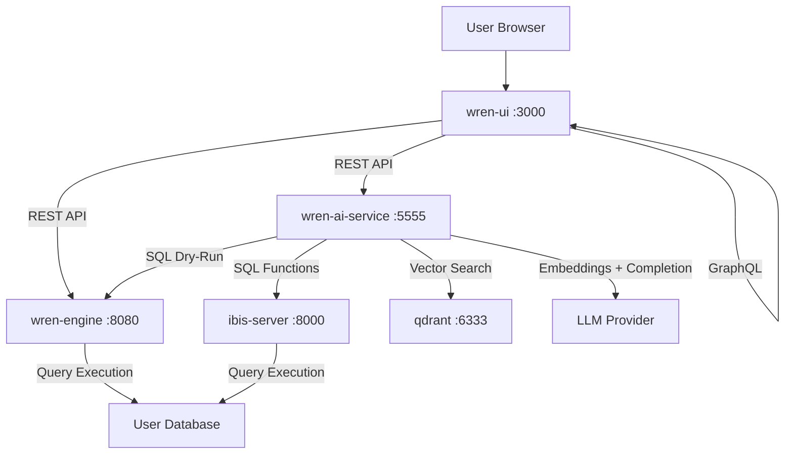
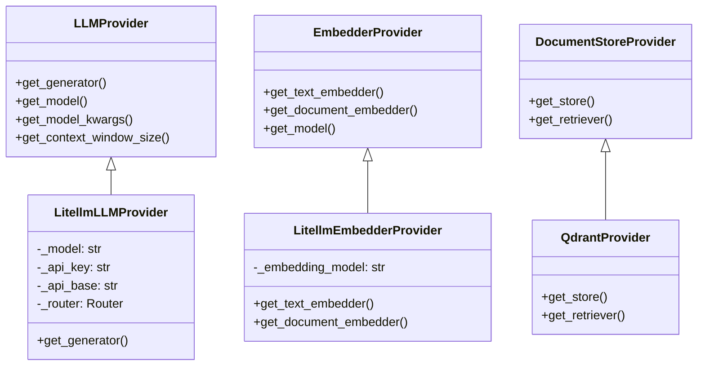
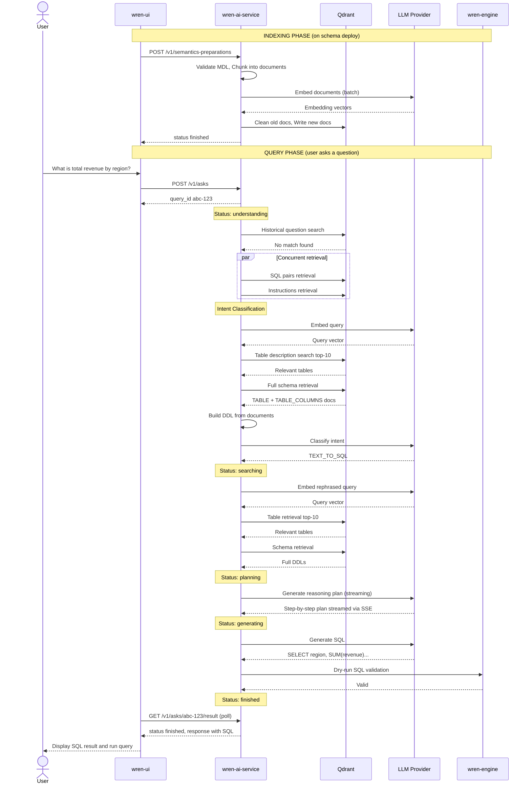

# WrenAI — Complete Architecture & Logic Report

> Full line-by-line analysis of the WrenAI project: every service, every pipeline, and the exact workflow from a user's question to a SQL answer.

---

## Table of Contents

1. [System Overview & Microservice Architecture](#1-system-overview--microservice-architecture)
2. [Docker Composition & Service Topology](#2-docker-composition--service-topology)
3. [wren-ai-service: The AI Brain](#3-wren-ai-service-the-ai-brain)
4. [The Core Pipeline Architecture (Hamilton DAGs)](#4-the-core-pipeline-architecture)
5. [Indexing Pipelines — How Data is Prepared](#5-indexing-pipelines)
6. [The Complete User Question to SQL Answer Workflow](#6-the-complete-user-question-to-sql-answer-workflow)
7. [Relationship Recommendation Pipeline](#7-relationship-recommendation-pipeline)
8. [Question Recommendation Pipeline](#8-question-recommendation-pipeline)
9. [Other Generation Pipelines](#9-other-generation-pipelines)
10. [wren-ui: The Frontend & GraphQL Layer](#10-wren-ui-the-frontend--graphql-layer)
11. [wren-engine: The SQL Execution Engine](#11-wren-engine-the-sql-execution-engine)
12. [Complete Data Flow Diagram](#12-complete-data-flow-diagram)

---

## 1. System Overview & Microservice Architecture

WrenAI is a **Text-to-SQL AI assistant** that allows non-technical users to ask natural language questions about their database and receive accurate SQL queries and data answers. The system is composed of 6 Docker containers working together:

| Service | Technology | Purpose |
|---------|-----------|---------|
| **wren-ui** | Next.js (TypeScript) | Web frontend + Apollo GraphQL BFF |
| **wren-ai-service** | FastAPI (Python) | AI brain — LLM orchestration, RAG pipelines |
| **wren-engine** | Java | SQL parsing, validation, and MDL management |
| **ibis-server** | Python | Database connector (Ibis framework) |
| **qdrant** | Rust | Vector database for semantic search |
| **bootstrap** | Shell script | Data initialization |

---

## 2. Docker Composition & Service Topology

From [docker-compose.yaml](file:///c:/Projects/WrenAI/docker/docker-compose.yaml):



**Key connections:**
- `wren-ui` talks to `wren-ai-service` via REST HTTP (e.g., `POST /v1/asks`, `GET /v1/asks/{id}/result`)
- `wren-ai-service` talks to the LLM provider (OpenAI, DeepInfra) via `litellm`
- `wren-ai-service` talks to Qdrant for vector storage/retrieval
- `wren-ai-service` talks to `wren-engine` for SQL dry-runs (validation)

---

## 3. wren-ai-service: The AI Brain

### 3.1 Application Entry Point

[`__main__.py`](file:///c:/Projects/WrenAI/wren-ai-service/src/__main__.py)

The service boots as a **FastAPI** application:

```python
# Startup sequence:
# 1. Settings loaded (config.yaml + .env)
# 2. pipe_components = generate_components(settings.components)  -> Instantiate all providers
# 3. app.state.service_container = create_service_container(pipe_components, settings)
# 4. app.state.service_metadata = create_service_metadata(pipe_components)
# 5. init_langfuse(settings)  -> Observability
```

The app runs on `uvicorn` with `uvloop` for high async performance, listening on port `5555`.

### 3.2 Configuration System

[`config.py`](file:///c:/Projects/WrenAI/wren-ai-service/src/config.py)

The `Settings` class follows a **layered configuration** model with this priority (highest last):

```
Default values -> Environment variables -> .env.dev -> config.yaml
```

The `config.yaml` is a **multi-document YAML** (separated by `---`) containing:
1. **LLM provider config** — model name, kwargs (temperature, max_tokens, seed)
2. **Embedder provider config** — embedding model name
3. **Engine config** — wren_ui and ibis endpoints
4. **Document store config** — Qdrant location and embedding dimensions
5. **Pipeline wiring** — which provider each pipeline uses
6. **Settings overrides** — feature flags, thresholds

### 3.3 Provider System

[`providers/__init__.py`](file:///c:/Projects/WrenAI/wren-ai-service/src/providers/__init__.py)

The provider system uses a **factory pattern** with a plugin loader:



**LiteLLM Provider** ([`providers/llm/litellm.py`](file:///c:/Projects/WrenAI/wren-ai-service/src/providers/llm/litellm.py)):
- Uses `litellm.acompletion()` for async LLM calls
- `litellm.drop_params = True` — drops unsupported params (e.g., `seed` for DeepInfra)
- **Retry logic**: `@backoff.on_exception(backoff.expo, (openai.APIError, litellm.exceptions.RateLimitError), max_time=300.0, max_tries=10)`
- Supports **fallback models** via `litellm.Router`

**LiteLLM Embedder** ([`providers/embedder/litellm.py`](file:///c:/Projects/WrenAI/wren-ai-service/src/providers/embedder/litellm.py)):
- Uses `litellm.aembedding()` for async embedding calls
- Supports batched document embedding with `AsyncDocumentEmbedder`
- Same robust retry logic as the LLM provider

### 3.4 Global Service Container

[`globals.py`](file:///c:/Projects/WrenAI/wren-ai-service/src/globals.py)

The `ServiceContainer` is a dataclass that wires **every pipeline** to its corresponding **service**:

```python
@dataclass
class ServiceContainer:
    ask_service: AskService                           # Main Q&A flow
    ask_feedback_service: AskFeedbackService          # SQL regeneration on feedback
    question_recommendation: QuestionRecommendation   # "What could I ask?"
    relationship_recommendation: RelationshipRecommendation  # Table relationship suggestions
    semantics_description: SemanticsDescription       # Column/table descriptions
    semantics_preparation_service: SemanticsPreparationService  # Schema indexing
    chart_service: ChartService                       # Chart generation
    chart_adjustment_service: ChartAdjustmentService  # Chart adjustments
    sql_answer_service: SqlAnswerService              # Natural language answers from SQL
    sql_pairs_service: SqlPairsService                # Custom SQL examples
    sql_question_service: SqlQuestionService           # SQL-based question generation
    instructions_service: InstructionsService          # Custom instructions management
    sql_correction_service: SqlCorrectionService       # Standalone SQL correction
```

Each service receives a `pipelines` dict containing the actual pipeline instances.

---

## 4. The Core Pipeline Architecture

WrenAI uses **Hamilton** (by DAGWorks) as its pipeline orchestration framework. Hamilton turns Python functions into a **Directed Acyclic Graph (DAG)** where:

- Each function's **name** becomes a node
- Each function's **parameters** define its dependencies (edges)
- The `AsyncDriver` executes the DAG asynchronously

**Example DAG** (Intent Classification):
```
embedding -> table_retrieval -> dbschema_retrieval -> construct_db_schemas -> prompt -> classify_intent -> post_process
```

Every pipeline follows this pattern:

```python
class SomePipeline(BasicPipeline):
    def __init__(self, llm_provider, embedder_provider, ...):
        self._components = {
            "embedder": embedder_provider.get_text_embedder(),
            "generator": llm_provider.get_generator(system_prompt=..., generation_kwargs=...),
            "prompt_builder": PromptBuilder(template=...),
        }
        super().__init__(AsyncDriver({}, sys.modules[__name__], ...))

    async def run(self, query, ...):
        return await self._pipe.execute(
            ["post_process"],       # Target output node
            inputs={...},           # Input data + components
        )
```

---

## 5. Indexing Pipelines

Indexing happens when the user first connects a data source or when the schema changes. The `SemanticsPreparationService` runs **5 indexing pipelines in parallel**:

```python
tasks = [
    self._pipelines["db_schema"].run(**input),
    self._pipelines["historical_question"].run(**input),
    self._pipelines["table_description"].run(**input),
    self._pipelines["sql_pairs"].run(**input),
    self._pipelines["project_meta"].run(**input),
]
await asyncio.gather(*tasks)
```

### 5.1 DB Schema Indexing

[`pipelines/indexing/db_schema.py`](file:///c:/Projects/WrenAI/wren-ai-service/src/pipelines/indexing/db_schema.py)

**Pipeline DAG**: `validate_mdl -> chunk -> embedding -> clean -> write`

1. **validate_mdl**: Parses the MDL (Model Definition Language) JSON string
2. **chunk (DDLChunker)**:
   - Converts MDL models into DDL-like documents
   - Creates **TABLE** documents (table metadata + comment)
   - Creates **TABLE_COLUMNS** documents (columns batched by `column_batch_size=50`)
   - Creates **FOREIGN_KEY** constraints from relationships
   - Creates **VIEW** and **METRIC** documents
3. **embedding**: Converts each document chunk into a vector via `AsyncDocumentEmbedder`
4. **clean**: Deletes old documents for the project from Qdrant
5. **write**: Writes the new embedded documents to Qdrant

### 5.2 Table Description Indexing

Creates summary descriptions of each table for semantic search. These are stored as `TABLE_DESCRIPTION` type documents in a separate Qdrant collection (`table_descriptions`).

### 5.3 Historical Question Indexing

Indexes previously asked questions and their SQL answers for future reuse (exact match retrieval).

### 5.4 SQL Pairs Indexing

Indexes user-provided SQL examples (question to SQL pairs) for few-shot learning during generation.

### 5.5 Instructions Indexing

Indexes custom user instructions (e.g., "Always use UTC for timestamps") that are retrieved and injected into prompts.

### 5.6 Project Meta Indexing

Stores project-level metadata (data source type, etc.) used for SQL generation context.

---

## 6. The Complete User Question to SQL Answer Workflow

This is the **core pipeline** — the most critical flow in the entire application. Here is exactly what happens when a user types "What is the total revenue by region?" and clicks Ask.

### 6.1 Step 1: HTTP Request Handling

**Router**: [`web/v1/routers/ask.py`](file:///c:/Projects/WrenAI/wren-ai-service/src/web/v1/routers/ask.py)

```
POST /v1/asks
```

1. A `query_id` (UUID) is generated
2. The initial status is set to `"understanding"`
3. The actual `ask()` method is dispatched as a **FastAPI background task** (non-blocking)
4. The UUID is immediately returned to the caller

The frontend then **polls** `GET /v1/asks/{query_id}/result` to check progress through status transitions:

```
understanding -> searching -> planning -> generating -> correcting -> finished/failed
```

### 6.2 Step 2: Historical Question Retrieval

**Service**: [`web/v1/services/ask.py`](file:///c:/Projects/WrenAI/wren-ai-service/src/web/v1/services/ask.py) — Lines 192-212

The first thing the system does is check if this question has been asked before:

```python
historical_question = await self._pipelines["historical_question"].run(
    query=user_query,
    project_id=ask_request.project_id,
)
```

- If a match is found (similarity > 0.9 threshold), the **cached SQL is returned immediately** — no LLM call needed
- If it is a view-based result, the `viewId` is returned too

> [!TIP]
> This is a **short-circuit optimization**. If the user asks the same question twice, the second time is near-instant.

### 6.3 Step 3: SQL Pairs & Instructions Retrieval

**Service**: Lines 216-234

Both retrievals run **concurrently** via `asyncio.gather()`:

```python
sql_samples_task, instructions_task = await asyncio.gather(
    self._pipelines["sql_pairs_retrieval"].run(query=user_query, ...),
    self._pipelines["instructions_retrieval"].run(query=user_query, ...),
)
```

- **SQL Pairs**: Retrieved user-provided SQL examples (similar questions to SQL) for few-shot learning
- **Instructions**: Retrieved custom rules (filtered by `scope="sql"`)

### 6.4 Step 4: Intent Classification

**Pipeline**: [`pipelines/generation/intent_classification.py`](file:///c:/Projects/WrenAI/wren-ai-service/src/pipelines/generation/intent_classification.py)

**DAG**: `embedding -> table_retrieval -> dbschema_retrieval -> construct_db_schemas -> prompt -> classify_intent -> post_process`

This is a **critical routing step** that determines what to do with the user's question:

| Intent | Action | Example |
|--------|--------|---------|
| `TEXT_TO_SQL` | Continue to SQL generation | "Total revenue by region" |
| `MISLEADING_QUERY` | Return a polite redirect | "Hello, how are you?" |
| `GENERAL` | Return data assistance | "What is this dataset about?" |
| `USER_GUIDE` | Return WrenAI usage help | "How do I draw a chart?" |

**System prompt** (Lines 25-116): A detailed expert prompt that instructs the LLM to:
1. Combine current question with chat history
2. Rephrase follow-up questions into standalone questions
3. Classify into one of the 4 intents
4. Provide 20-word reasoning

**Internal mechanics**:
1. The user query is embedded using the embedder
2. `table_retrieval`: Searches Qdrant `table_descriptions` store for relevant tables
3. `dbschema_retrieval`: Fetches the full schema (TABLE + TABLE_COLUMNS documents) for those tables
4. `construct_db_schemas`: Assembles complete DDL strings from the retrieved documents
5. `prompt`: Builds the full prompt with schema, SQL samples, instructions, user guide docs, chat history
6. `classify_intent`: Calls the LLM with JSON structured output
7. `post_process`: Parses the JSON response, extracts `intent`, `rephrased_question`, `reasoning`

**Branching logic** (Lines 256-335):

```python
if intent == "MISLEADING_QUERY":
    # Launch misleading_assistance pipeline (async, streaming)
    # Return immediately with type="GENERAL"
elif intent == "GENERAL":
    # Launch data_assistance pipeline (async, streaming)
    # Return immediately with type="GENERAL"
elif intent == "USER_GUIDE":
    # Launch user_guide_assistance pipeline (async, streaming)
    # Return immediately with type="GENERAL"
else:  # TEXT_TO_SQL
    # Continue to Step 5...
```

### 6.5 Step 5: DB Schema Retrieval (RAG)

**Pipeline**: [`pipelines/retrieval/db_schema_retrieval.py`](file:///c:/Projects/WrenAI/wren-ai-service/src/pipelines/retrieval/db_schema_retrieval.py)

**DAG**: `embedding -> table_retrieval -> dbschema_retrieval -> construct_db_schemas -> check_using_db_schemas_without_pruning -> prompt -> filter_columns_in_tables -> construct_retrieval_results`

**Status**: `"searching"`

This is the **Retrieval Augmented Generation (RAG)** step — finding the relevant database tables and columns:

1. **embedding**: Embed the user query (+ history) into a vector
2. **table_retrieval**: Search Qdrant for the top-k most relevant tables (`table_retrieval_size=10`)
3. **dbschema_retrieval**: For each retrieved table, fetch its full schema (TABLE + TABLE_COLUMNS chunks)
4. **construct_db_schemas**: Reassemble full table schemas from chunks, handling batch reunification
5. **check_using_db_schemas_without_pruning**: Build DDL strings, check token count against LLM context window
6. **Column Pruning** (optional): If the DDL exceeds the context window OR `enable_column_pruning=True`:
   - A secondary LLM call (`filter_columns_in_tables`) selects only the relevant columns
   - Uses structured JSON output with chain-of-thought reasoning per table
7. **construct_retrieval_results**: Final output with `table_name`, `table_ddl`, and flags for `has_calculated_field`, `has_metric`, `has_json_field`

> [!IMPORTANT]
> If **no relevant documents** are found, the pipeline short-circuits with `NO_RELEVANT_DATA` error.

### 6.6 Step 6: SQL Generation Reasoning (Planning)

**Pipeline**: [`pipelines/generation/sql_generation_reasoning.py`](file:///c:/Projects/WrenAI/wren-ai-service/src/pipelines/generation/sql_generation_reasoning.py)

**Status**: `"planning"`

Before generating SQL, the system creates a **step-by-step reasoning plan**:

1. **prompt**: Combines the database schema DDLs, SQL samples, instructions, and user question
2. **generate_sql_reasoning**: Calls the LLM with **streaming** enabled — the reasoning is streamed to the UI in real-time via SSE (Server-Sent Events)
3. **post_process**: Returns the reasoning text

This reasoning is then fed into the next step as `sql_generation_reasoning` to guide SQL generation.

> For follow-up questions (with history), the `followup_sql_generation_reasoning` pipeline is used instead, which includes previous SQL context.

### 6.7 Step 7: SQL Generation

**Pipeline**: [`pipelines/generation/sql_generation.py`](file:///c:/Projects/WrenAI/wren-ai-service/src/pipelines/generation/sql_generation.py)

**Status**: `"generating"`

**DAG**: `prompt -> generate_sql -> post_process`

1. **SQL Functions Retrieval** (optional): Fetches database-specific SQL functions from `ibis-server`
2. **SQL Knowledge Retrieval** (optional): Fetches SQL knowledge base entries
3. **prompt**: Builds the final generation prompt with:
   - Database schema DDLs
   - Calculated field instructions (if applicable)
   - Metric instructions (if applicable)
   - JSON field instructions (if applicable)
   - SQL functions reference
   - SQL samples (few-shot examples)
   - User instructions
   - The user's question
   - The reasoning plan from Step 6
4. **generate_sql**: Calls the LLM with a detailed system prompt containing **strict SQL rules**:
   - Use ANSI SQL
   - Always quote table/column names
   - Never use `*` — list columns explicitly
   - Handle calculated fields via subqueries
   - Handle metrics via specific patterns
5. **post_process** (`SQLGenPostProcessor`):
   - Parses the JSON response to extract the SQL
   - **Dry-runs** the SQL against `wren-engine` to validate it
   - Returns `valid_generation_result` or `invalid_generation_result`

### 6.8 Step 8: SQL Validation & Dry-Run

The `SQLGenPostProcessor` performs validation:

```python
# Extracts SQL from LLM response
# Sends SQL to wren-engine for dry-run validation
# If valid -> returns {"valid_generation_result": {"sql": "..."}}
# If invalid -> returns {"invalid_generation_result": {"sql": "...", "error": "..."}}
```

The dry-run catches:
- Syntax errors
- Missing table/column references
- Type mismatches
- Engine-specific limitations

### 6.9 Step 9: SQL Correction Loop

**Pipeline**: [`pipelines/generation/sql_correction.py`](file:///c:/Projects/WrenAI/wren-ai-service/src/pipelines/generation/sql_correction.py)

**Status**: `"correcting"`

If the generated SQL fails dry-run, a **correction loop** begins:

```python
while current_sql_correction_retries < max_sql_correction_retries:  # default: 3
    if failed_dry_run_result["type"] == "TIME_OUT":
        break  # Don't retry timeouts

    # Step 9a: SQL Diagnosis (optional)
    sql_diagnosis_results = await self._pipelines["sql_diagnosis"].run(
        contexts=table_ddls,
        original_sql=original_sql,
        invalid_sql=invalid_sql,
        error_message=error_message,
    )

    # Step 9b: SQL Correction
    sql_correction_results = await self._pipelines["sql_correction"].run(
        contexts=table_ddls,
        invalid_generation_result={"sql": original_sql, "error": diagnosis_or_error},
    )

    # Check if corrected SQL passes dry-run
    if valid_generation_result:
        api_results = [AskResult(sql=valid_sql)]
        break  # Success!

    # Otherwise, loop with the new error
    failed_dry_run_result = correction_results["invalid_generation_result"]
```

The correction prompt includes:
- The original database schema
- The invalid SQL
- The specific error message (or diagnosis reasoning)
- SQL functions reference
- User instructions

### 6.10 Step 10: Response Delivery

**Final status**: `"finished"` or `"failed"`

```python
if api_results:
    self._ask_results[query_id] = AskResultResponse(
        status="finished",
        type="TEXT_TO_SQL",
        response=api_results,  # [{sql: "SELECT ...", type: "llm"}]
        rephrased_question=rephrased_question,
        intent_reasoning=intent_reasoning,
        retrieved_tables=table_names,
        sql_generation_reasoning=sql_generation_reasoning,
    )
else:
    self._ask_results[query_id] = AskResultResponse(
        status="failed",
        error=AskError(code="NO_RELEVANT_SQL", message=error_message),
    )
```

The frontend picks this up on its next poll of `GET /v1/asks/{query_id}/result`.

---

## 7. Relationship Recommendation Pipeline

[`pipelines/generation/relationship_recommendation.py`](file:///c:/Projects/WrenAI/wren-ai-service/src/pipelines/generation/relationship_recommendation.py)

**DAG**: `cleaned_models -> prompt -> generate -> normalized -> validated`

**Purpose**: Automatically suggest FOREIGN KEY relationships between tables.

1. **cleaned_models**: Strips display names and relationship columns from the MDL
2. **prompt**: Sends the cleaned model schema to the LLM
3. **generate**: LLM suggests relationships with structured JSON output:
   ```json
   {
     "relationships": [
       {
         "name": "order_customer_fk",
         "fromModel": "orders",
         "fromColumn": "customer_id",
         "type": "MANY_TO_ONE",
         "toModel": "customers",
         "toColumn": "id",
         "reason": "Links orders to their customers"
       }
     ]
   }
   ```
4. **normalized**: Parses JSON response
5. **validated**: Cross-references against actual model columns, filters out:
   - Invalid relationship types (only `MANY_TO_ONE`, `ONE_TO_MANY`, `ONE_TO_ONE`)
   - References to non-existent models or columns

---

## 8. Question Recommendation Pipeline

[`web/v1/services/question_recommendation.py`](file:///c:/Projects/WrenAI/wren-ai-service/src/web/v1/services/question_recommendation.py)

**Purpose**: Generate the "What could I ask?" suggestions on the homepage.

**Workflow**:
1. Retrieve all table DDLs from the database schema
2. Call the `question_recommendation` pipeline to generate candidate questions with categories
3. For **each** candidate question, run a **full validation cycle**:
   - Retrieve relevant DB schema
   - Retrieve SQL pairs and instructions
   - Generate SQL for the candidate question
   - Dry-run the SQL
   - Only keep questions with valid SQL
4. Group validated questions by category (max 3 categories, max 5 per category)
5. If `regenerate=True`, retry for categories with insufficient questions

> [!NOTE]
> This is why "Generating questions" takes about a minute — it is running the full SQL generation pipeline for every candidate question.

---

## 9. Other Generation Pipelines

| Pipeline | File | Purpose |
|----------|------|---------|
| **SQL Answer** | `sql_answer.py` | Generates natural language explanations from SQL results |
| **Chart Generation** | `chart_generation.py` | Generates chart configurations from SQL data |
| **Chart Adjustment** | `chart_adjustment.py` | Adjusts existing charts based on user feedback |
| **Semantics Description** | `semantics_description.py` | Generates column/table descriptions |
| **Data Assistance** | `data_assistance.py` | Answers general data questions (streaming) |
| **Misleading Assistance** | `misleading_assistance.py` | Politely redirects off-topic queries (streaming) |
| **User Guide Assistance** | `user_guide_assistance.py` | Answers WrenAI usage questions (streaming) |
| **SQL Regeneration** | `sql_regeneration.py` | Regenerates SQL based on user feedback |
| **Follow-up SQL Gen** | `followup_sql_generation.py` | Generates SQL with conversation history context |
| **SQL Tables Extraction** | `sql_tables_extraction.py` | Extracts table names from SQL queries |
| **SQL Diagnosis** | `sql_diagnosis.py` | Diagnoses SQL errors before correction |
| **SQL Question** | `sql_question.py` | Generates questions from SQL queries |

---

## 10. wren-ui: The Frontend & GraphQL Layer

The UI is a **Next.js** application with an embedded **Apollo GraphQL** server:

```
Frontend (React)
   <-> GraphQL (Apollo Client)
Backend (Apollo Server)
   <-> REST HTTP
wren-ai-service / wren-engine / ibis-server
```

**Key adaptors** in [`wren-ui/src/apollo/server/adaptors/`](file:///c:/Projects/WrenAI/wren-ui/src/apollo/server/adaptors):

| Adaptor | Communicates With | Purpose |
|---------|------------------|---------|
| `wrenAIAdaptor.ts` | wren-ai-service | Ask questions, get recommendations, deploy schemas |
| `wrenEngineAdaptor.ts` | wren-engine | Execute SQL, manage MDL |
| `ibisAdaptor.ts` | ibis-server | Database metadata, query execution |

**Key services** in [`wren-ui/src/apollo/server/services/`](file:///c:/Projects/WrenAI/wren-ui/src/apollo/server/services):

| Service | Responsibility |
|---------|---------------|
| `askingService.ts` | Manages the ask workflow, threading, polling |
| `askingTaskTracker.ts` | Tracks async task status across polling |
| `modelService.ts` | CRUD operations on data models |
| `deployService.ts` | Deploys MDL changes to the AI service |
| `projectService.ts` | Project management and data source connection |
| `queryService.ts` | Direct SQL query execution |

---

## 11. wren-engine: The SQL Execution Engine

The wren-engine is a **Java-based SQL engine** that:

1. **Parses and validates SQL** against the MDL (data model)
2. **Dry-runs SQL** to check for errors before execution
3. **Executes SQL** against the connected database
4. **Manages the MDL** — the semantic layer definition

The engine exposes REST APIs that `wren-ai-service` calls for SQL validation.

---

## 12. Complete Data Flow Diagram



---

> [!IMPORTANT]
> ### Key Architectural Insights
>
> 1. **Everything is async** — From FastAPI background tasks to Hamilton async drivers to litellm async calls
> 2. **RAG is the foundation** — Qdrant vector search is used to find relevant tables/columns before any LLM call
> 3. **Self-correcting** — The SQL correction loop (up to 3 retries) with optional diagnosis ensures high SQL quality
> 4. **Streaming** — Reasoning and general assistance responses are streamed via SSE for responsive UX
> 5. **Pluggable providers** — The provider factory + loader pattern allows swapping LLM/embedder backends via config
> 6. **Hamilton DAGs** — Each pipeline is a declarative function graph, making the logic traceable and testable
> 7. **Multi-tier caching** — Historical questions (similarity), TTL caches on results, and query caches reduce redundant LLM calls
